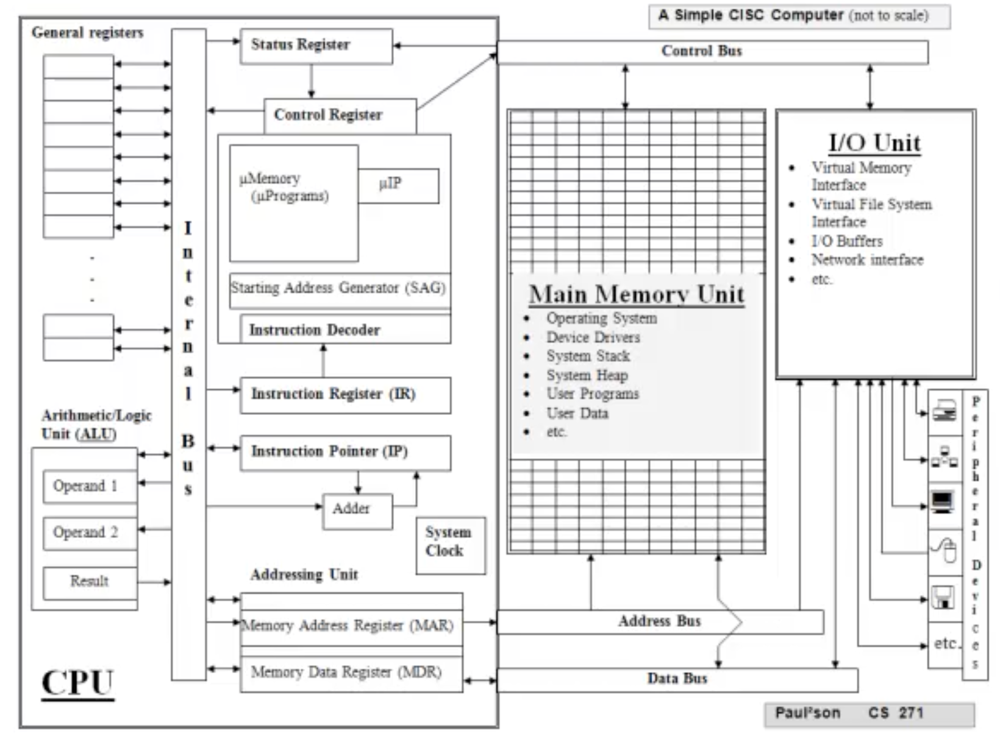
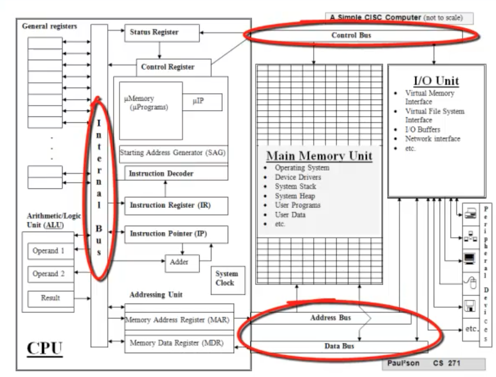
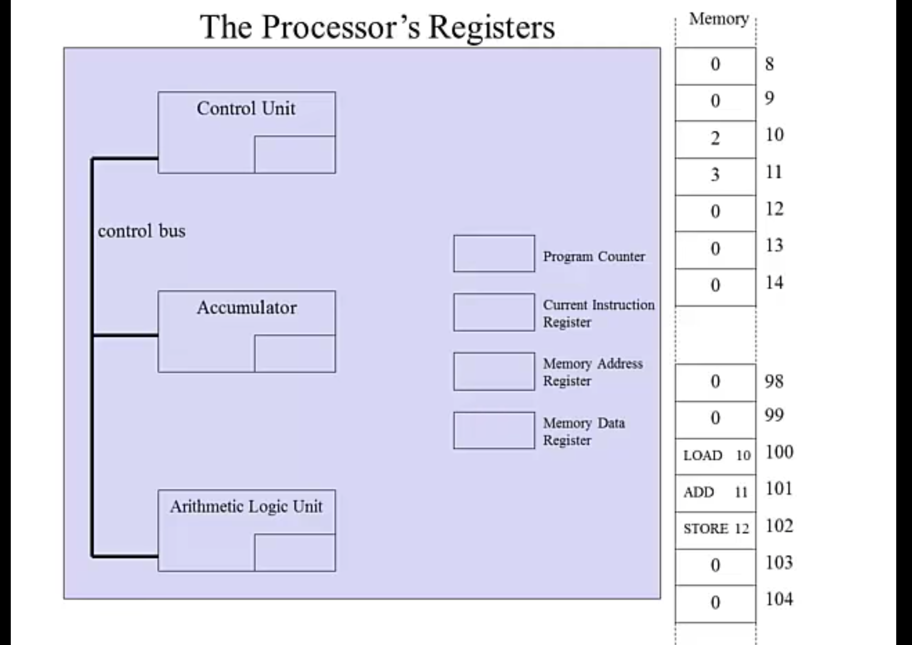

# Week 1: Computer Architecture Assembly Basics

[Introduction to hardware, software and languages](#introduction-to-hardware-software-and-languages)

[How Computer Hardware Works](#how-computer-hardware-works)

[Fetch Decode Execute Cycle](#fetch-decode-execute-cycle)

[Introduction to Intel IA-32 Architecture](#introduction-to-intel-ia-32-architecture)

[MASM instruction](#masm-instruction)


***
# Introduction to hardware software and languages

## Problem-Solving Language View by "Levels"

### Natural Languages
- English, Spainsh
- Used by huamns
- Many Interpretations
- Translated to programming languages by computer programmers
- Word Processors


### High-Level computer programming languages
- Java, C++, Perl, Python
- English-like, protable various architrctures ** 可以跨平台運作
- Strict rule of syntax and semantics
- Translatd to lower levels by  【compilers/translators】
- Text editor, libraries, compiler, linker, loader, debugger
- Eclipse, Visual C++ etc.


### Low-Level computer programming languages
- Intel assembly, Mac assembly
- Mnemonic instructions for specific computer architectures** 必須要針對特殊的電腦架構
- Translated to machine language by 〖assemblers〗
- Text editor, libraries, assembler, linker, loader, debugger
- Any text editor together with MASM, Visual C++, etc.


### Machine-level computer languages
- Intel mahcine instructions, Mac machine instructions
- Actual binary code instructions for specific architecture
- Some way to assign machine instructions directly into computer memory
- Set Individual bits(switches), lader

***

## Computer Languages / Computer hardware (Simplified)

### Level 4: Probelm solution in natural language
- Description of algorithm, solution design
- Programmer translates to

### Level 3: Computer program in high-level computer programming language
- Source code(machine independent)
- Compiler translates to

### Level 2: Program in assembly language
- Machine specific commands to control hardware components
- Assembler translates to

#### Level 1: Program in machine code
- Operating System does partial translation
- The hardware's instruction set architecture(ISA) provides a micro-program for each machine instruction(CISC* ) or direct execution(RISC*)

#### Level 0: Actual computer hardware
- Program in electronic form

***

## Assembly Language(Not a machine language)

### 1. Set of mnemonics for machine instructions
- Opcodes and addressing modes

### 2. Mechanism for naming memory addresses and other constants.
- Noed: a named memory address is usually called a variable

### 3. Other conveniences for developing source code for particular machine architecture.

An assembler is a software system that takes assembly language as input and produces machine language as output.(Object code)

## Opearting System
- Provide interfaces among users, programs, and devices(including the host computer itself).

- Implemented for specific architecture (in the host computer's machine language) and Recognize the machine instructure sets.

***

## Relationshop between Instruction Set and Architecture

A computer's instruction set is defined by the computer's architecture.
(each computer archecture has its own machine language)

- Cross-assemblers(software) can be used to convert a machine language to another machine language.
- Virtual Machine(Software) can be used to simulate anothr computer's architecture.

##### Hardware: Physical devices
#### Software: Instructions that control hardward

Sometimes, the line between hardward and sofrware is not clear since parts of an operating system might be implemented in hardware.

```
Anything that can be implemented in software could be implemented in hardware and it would execute much faster.

## Discussion Question #1

If it's so much faster, why isn't everything implemented in hardware?
```
***

## System Architrctures (From large to tiny)

- Super Computer
- Mainframe
- Multiprocrssor/Parallel(multi-core)
- Server
- Distributed(Collection of Workstations)
- Personal Computer
- Micro-Controller(Real-time/Embedded System)

```
## Discussion Question #2
Try to explain: How big is namometer?

## Discussion Questoin #3
What does Moore's Law mean?
```
***

## Why use assembly language
- Easier than machine code (electrical signals)
- Access to all features of target machine by command codes
- Performance(Maybe) - Higer level language didn't have access to memory 
- Using mixed Languages (Some function with assembly with C language)
- Note that assembly language tends to evolve toward a high-level language

## Common uses of assembly language
- Embedded systems (Efficiency is critical)
- Real-Time applications (Timing is critical)
- Interactive Games(Speed is cirtical)
- Low-Level tasks(Direct control is cirtical)
- Device Drivers

***

# How Computer Hardware Works

## Preliminaries
Inside a computer, information is represented electrically. Smallest unit of information is a "switch".

We Often represent 'off' as 0 and 'on' as 1, so a single switch represents "a binary digit" and is called a 'bit'.

Different combination of switches represent different information. (A group of 8 bits is called a byte)

### A Simple CISC Computer



### Peripheral Devices (Exernal Devices) 
- Store/Retrieve data(Non-volatile Storage)
- Convert data between human-readable and machine readable froms.
- Keyborad


### I/O Unit: Hardware/Software functions
- Communicate between CPU/Memory and peripheral devices.
- Virtual Memory Interface
- Virtual File System Interface
- I/O
- Partly on software and hardware

### Main memory Unit: Cells with address

所有程序需要使用的時候，都會經由Main memory

- Store programs and data currently being used by the CPU (volatile storage - If electrical power is inturrcted) -> Secondry memory is unvolatile
- Accessable for the CPU
- Operating System
- Device Driver
- System Stack
- System Heap
- User Programs
- User Data

### CPU: Central Processing Unit **
- Execute machine instructions

***

## Components of CPU 

### Bus: Parallel "wires" for transferring a set of electrical signals simultaneously



信號在CPU內，透過Bus可以在CPU Component之間傳遞。

- Interanl Bus: Transfer signals among CPU components

- Control: Carries Bus signals for memory and I/O operations
- Address Bus: Linkes to specific memory locations
- Data Bus: Carries data CPU <=> memory

### Register 
- Directly connected with the Internal Bus
- Fast local memory inside the CPU
- Have General Registers and several specificed purposes registers.

### ALU 

Arithmetic/Logic Unit: Calculation and Comparison take place

### Microprogram

Sequence of micro-instructions (implemented in hardware) required to execute a machine instruction

### Micromemory
The actual hardware circuits that implement the machine instructions as microprograms.

***

## CPU Registers 

### Control Register
- Control Registers: dictates current state of the machine (Which signal goes where) 
- Control and Set by the System Clock
- 決定Signal要去哪

### Status Register
- Status Registers: indicates status of operation(error, overflow, etc). Used by Control Regiseter. To determine whether jump or don't jump to other instruction depends on the equal bit. 
- 決定 Control Register 是否要執行下一步，或是有無錯誤的操作和指令。


### Addressing Unit (Important)

Data Transfer between Main Memory and CPU

#### MAR (Memory Address Register)
- MAR (Memory Address Register): Hold address of memory location currently referenced and connected to that referenced address with the address bus

#### MDR (Memory Data Register)
- MDR (Memory Data Register): Holds data being sent to or retrieved from the memory address in the MAR. Hold the data that will be stroed or wait to receive the data that has been stroed


### Instructions
- IP (Instruction Pointer) : Holds memory address of next instruction to be copied from Main Memory into IR. [program counter (PC)]

- IR (Instruction Register) : Holds current machine instruction

- Instruction Decoder: IP and IR transfer to the instuction decoder to determine which instruction be executed

- Starting Adress Generator (SAG) : Where in micro memory that corrsponsding micro program will implement, the micro IP set up the next instuction in Control Register


### Arithmetic/Logic Unit (ALU)

- Operand_1, Operand_2, Result: ALU registers (for calculations and comparisons)

An accumulator is a register for short-term, intermediate storage of arithmetic and logic data in a computer's CPU (central processing unit). The term "accumulator" is rarely used in reference to contemporary CPUs, having been replaced around the turn of the millennium by the term "register."


### General Register

- General: Fast temporary storage for the data

*** 

## Cache (Faster memory)
An area of comparatively fast temporary stroage for information copied from slower storage.

- Main memory is the Cache of Peripheral Device(Secondry Storge)
- General Register is the Cache of Main Memory.
- Program instructions are moved from secondary storage to main memory, so they can be accessed more quickely.
- Data is moved from main memory to a CPU register, so it can be accessed instantaneously.

Caching takes place at several levels in a computer system.

***

## VonNeuman Architecture
computer architectures that store programs in memory, and execute them under the control of the instruction execution cycle.

***

[Program Counter and Instruction Register](https://stackoverflow.com/questions/15739489/program-counter-and-instruction-register)

The program counter (PC) holds the address of the next instruction to be executed.

The instruction register (IR) holds the encoded instruction. 

Upon fetching the instruction, the program counter is incremented by one "address value" (to the location of the next instruction). The instruction is then decoded and executed appropriately.The reason why you need both is because if you only had a program counter and used it for both purposes you would get the following troublesome system:

```
[Beginning of program execution]

PC contains 0x00000000 (say this is start address of program in memory)
Encoded instruction is fetched from the memory and placed into PC.
The instruction is decoded and executed.
Now it is time to move onto the next instruction so we go back to the PC to see what the address of the next instruction is. However, we have a problem because PC's previous address was removed so we have no idea where the next instruction is.
```

Therefore, we need another register to hold the actual instruction fetched from memory. Once we fetch that memory, we increase PC so that we know where to fetch the next instruction.

P.S. the width of the registers varies depending on the architecture's word size. For example, for a 32-bit processor, the word size is 32-bits. Therefore, the registers on the CPU would be 32 bits. Instruction registers are no different in dimensions. The difference is in the behavior and interpretation. Instructions are encoded in various forms, however, they still occupy a 32-bit register. 

***
## Instruction Execution Cycle


- IP (Instruction Pointer)
- IR (Instruction Register)

1. Fetch next instruction (at address in IP) into IR.

2. Increment IP to point to next instruction.

3. Decode instruction in IR

4. If instruction requires memory access,

- Determine memory address.
- Fetch operand from memoyr into a CPU register, or send operand from a CPU register to memory.

5. Execute micro-program for instruction
6. Go step 1 (unless the "halt" instruction has been executed)

```
## Discussion 
In the instruction Execution Cyle, why is it important to change the instruction pointer in step2? Wouldn't it work just as well to change it after step 5?
```
***

## Example CISC Instruction

```asm
ADD R1, mem1 ;Example assembly language instruction
```

1. Copy contents of R1 to ALU Operand_1
2. Move address mem1 to MAR
3. Singal memory fetch (get contents of memory address currently in MAR into MDR)
4. Copy contents of MDR into ALU Operand_2
5. Singal ALU addition
6. Set Status Register and Copy contents of ALU Result to register R1


***
## Fetch Decode Execute Cycle

[Fetch Decode Execute Cycle - Youtube video](https://www.youtube.com/watch?v=jFDMZpkUWCw)




Life Cycle: IP(PC) -> MAR -> MDR -> CIR -> Control Unit

### There are Three Instructions will be executed:

```
Load  [10] stored in memory [100]
Add   [11] stored in memory [101]
Store [12] stored in memory [102]

What inside the address:
[10] '2'
[11] '3'
[12] empty
```

### Executed Load [10] 

1. PC(IP) stores address of the next instruction to be fetched. || (Stored Memory address 100)

2. Before we can fetch the instruction from RAM, that memory address [100] can be loaded into the MAR. || (Stored Memory Address 100)

3. The contents of the memory address [100] should be loaded into the MDR. || (Stored Instruction Load [10])

4. Now we're fetching first instruction. The Instruction need to be placed inside the current IR. || (Stored Instruction Load [10])

5. The PC(IP) will increment by one. (Always pointing to the memory address of the next instruction to be fetched before we've executed the current instruction) ||(Stored Memory address 101)

6. Decode the instruction. Since the instruction is "Load [10]", we need to fetch the value from memory address [10].

7. The address of memory [10] now goes into MAR, and we take the content placed it into MDR overwriting its previous content. || (MAR stored the address of 10 and MDR stored the content of address 10 which is 2)

8. Content of address 2 was placed into the accumulator. [First Instruction is executed]

### Executed Add [11]

9. Now, the PC(IP) has already pointed to the memory address [101] of next instruction "Add [11]" || (Read the address stored in PC)

8. Copied the address from PC(IP) to MAR and take the content of that memory address [101] and put the instruction into MDR. || (Stroed the address of [101] in MAR and the instruction of "Add [11]" in MDR)

9. Moved instuction into current IR and decode it. (Stored the instruction into Current IR)

10. Increment the PC(IR). || (PC point to address [102])

11. Passed the instruciton stored in IR into Control Unit. (Pass instruction into Control Unit from IR)

12. Now, Add instruciton is passed into ALU by control bus. Contents of the accumulator are moved to another placed and ready to be worked with.

13. We need to fetch the content of address [11] since the ALU need to process the instruciotn. Thus, we stored the address 11 into MAR and get the contnets 3 to store into MDR. (Stroed address of [11] into MAR and contents of [11] into MDR)

14. Then, 3 is placed into the accumulator from MDR.

15. ALU will add these two number we had and placed the result back in accumularot as 5. || (ALU add the number passed from MDR and place back to Accumulator)
 
### Exected Store [12]

16.  Now, the PC(IP) has already pointed to the memory address [102] of next instruction "Store [12]" || (Read the address stored in PC)

17. MAR get copied of address [102] and put the instruciton "Stroe [12]" into MDR.

18. Last Instruction be moved into Current IR and PC(IR) increment one. (It might hace terminated instruciton in address [103])

19. Control Unit get the instruciton from Current IR and put the memory address of [12] into MAR as well as the contents of accumulator into MDR. 

20. Finally, the data in the MDR will be stored into the address in MAR wich is address 12.


***
## Conclsion 

Even in the simplest architectures
- Bus Arbitration required
- CPU scheduling required

As architrctures become more complex
- Multi-processor coordination required
- Cache management required

## Execution Time Calculate

```
Level 5 -    Level 4 -  Level 3   -   Level 2 -       Level 1 -     Level 0
High Level  Assembly    Operating   Instruction Set  Micro          Digit
Language    Language    System      Architecture     Architecture   Logic
```
Consider the virtual machine levels (except 0 and 5), an interpreter accepts an instruction from the level above, converts the instruction to its own language, and passes the resulting instructions to the level below. 

Note that Level-0 has no interpreter; the instructions from the Micro-architecture level are sent directly to the
hardware.

Suppose that the interpreters at each level (levels 1 - 4) generate n instructions in order to represent one instruction from the level above. Suppose also that each Level-0 instruction executes in c nanoseconds.

### How long does it take to execute a Level-3 instruction?
cn^2 ns. 

Going from level-3 to level-2 creates n instructions. For each of those n instructions, going from level-2 to level-1 creates n instructions, so there will be n2 micro-instructions, each of which requires c nano-seconds to execute.

### How long does it take to execute a Level-5 instruction? _cn4
cn^4 ns.


***
# Introduction to Intel IA-32 Architecture

## Two modes of operation:
- Protected
- Real-address

## Two processors in one
- integer unit
- floating-point unit
- Two processors can work in parallel(co-processors)

## Specific hardware implementations
- Registers
- Memory addressing scheme
- pecific instruction set and microprograms

### Metrics -> Ki = 2^10, Mi = 2^20, Gi = 2^30

### Bytes(B) and bit(b)
1 Mib = 128 KiB

Byte is the smallest unit of data that can be manipulated directly in the IA-32 architecture. Operating system and instruction decoder determine how byte codes are interpreted.

- integer
- character
- floating-point
- instruction
- address
- status bits

### Meory 

### 32-bit machine
- Registers
- Buses
- ALU

### 32-bit general-purpose registers

EAX / EBX / ECX / EDX

- EAX and EDX are automatically used by integer multiplication and division instruction
- ECX is automatically used as a counter for some looping instructions
- ESP is used for regerencing the system stack

Some 32-bit registers have 8-bit and 16-bit "sub-registers"

- If you change a sub-register, the value in the entire register is changed.

***
## Week Summary

1. The ASCII codes for alphabetic letters are smaller than for decimal digits.
- False

2. A signed integer stores the sign in the least significant bit (LSB).
- False

3. The three most basic operators in Boolean algebra are AND, OR, and NOT.
- True

4. Which of the following best describes the relationship between assembly language instructions and machine language instructions?
- one to one 

6. What is the largest signed integer that may be stored in 32 bits?
- 2^31 -1

7. How many bits are used by Unicode characters in MS-Windows?
- 16

9. The two's complement of an integer is formed by doing which of the following?
- reversing (inverting) the bits and adding 1 

10. What is the largest unsigned integer that may be stored in 24 bits?
-  16,777,215 

11. If an integer's sign bit is 1, the integer is positive.
- False

12. Which list contains the correct hexadecimal translation (in order) of the following unsigned decimal integers? 33, 95, 257
- 21, 5F, 101 

13.  Device drivers nearly always contain some code written in
- assembly language 

14. Which of the following is the binary translation of signed decimal -33 ?
- 11011111 

15. A signed byte can be equal to +127.
- True


16. What is the name of the lowest 8 bits of the EDX register?
- DL

17. How much memory can be addressed in Real-address mode?
- 1MB

18. List the three primary steps of the instruction execution cycle, in sequential order.
Correct!

- Fetch, Decode, Execute

19. Which internal bus uses binary signals to synchronize actions of all devices attached to the system bus?
- Control Bus

20. The four parts of a CPU are:
-  clock, registers, control unit, arithmetic logic unit 

21. What is the name of the time delay in a CPU caused by differences between the speed of the CPU, the system bus, and memory circuits?
- Wait State

22. Within the CPU, all calculations and logic operations take place inside the ___________ .

- ALU

A program that combines object files into an executable program is called a _________.

- Linker


23. Which register is known as a loop counter?

-  ECX 

24. During which phase of the instruction execution cycle is the program counter incremented?

- Fetch

25. How much memory can be addressed in Protected mode?
- 4GB

26. Which of the following defines a text macro named MESSAGE that contains this string data? "I'm good at this!",0
- MESSAGE TEXTEQU <"I'm good at this!",0>

27. Which of the following are valid data definition statements that create an array of unsigned bytes containing decimal 10, 20, and 30, named myArray?
-   myArray BYTE 10, 20, 30

28. The following are both valid data definition statements:  
```asl
List1 BYTE 10,20
       BYTE 30,40
```

- True

29. An identifier may begin with a digit.
- False(with letter)


30. In the following data definition, assume that List2 begins at offset 2000h. What is the offset of the third value (5)?
```
List2 WORD 3,4,5,6,7
```
- 2004h

31. The EQU directive permits a constant to be redefined at any point in a program.
- False

32. Which utility program reads an assembly language source file and produces an object file?
- assemblr

33. In the AddSub program in Section 3.2, the exit statement calls which predefined MS-Windows function to halt the program?
- ExitProcess

34. Which directive is used when defining 64-bit IEEE long reals?
- REAL8

35. The following is a valid data definition statement:   
```
str1 \
BYTE "This string is quite long!",0
```
- True

36. A word (on x86 systems) is 16 bits
- True

37. If you wanted to find out whether an integer contained an even number of 1 bits, which status flag would be useful?

- Parity

38. High-speed memory that reduces the frequency of access by the CPU to conventional memory is called?

- cache memory

39. The three types of buses connected to the CPU are:
- data, address, control


40. Which letter choice shows the memory byte order, from low to high address, of the following data definition?

- 78h,56h,34h,12h


41. Select a data definition statement that creates an array of 500 signed doublewords named myList and initializes each array element to the value -1. 

- myList SDWORD 500 DUP (-1)

42. The byte-ordering scheme used by computers to store large integers in memory with the high-order byte at the lowest address is called:

- Big Endian

43. Which directive identifies the part of a program containing instructions?
- .code

***

# MASN instruction
- Move data
- Arithmetic
- Compare two values
- Conditional / Unconditional Branch
- Call procedure, return
- Loop control
- I/O (input/output)

# Directive
Tell the assembler how to interpret the code
- Mark beginning of program segments: .data / .code
- Mark special labels: main proc / varName DWORD


## TITLE Directives

- you can put anything you want
- ;identification block

## INCLUDE driectives
- Copies a file of definition s and procedures into the source code
- use Irvine32.inc for now

## .data directive 
- marks beginning of data segment
- variable declarations go here

## .code directive
- marks end of data segment and beginning of code segment

### main procedure
Define here in .code directive
- other procedures defined here optionally
- main must have an exit instruction
- all procedures require PROC and ENDP directives

## END directive
- Tell operting system where to begin execution

# MASM data types syntax

| Type | Used for                         |
|:----:|:--------------------------------:|
| BYTE | Character, string, 1-byte integer|
| WORD | 2-byte integer, address          |
|DWORD | 4-byte unsigned integer, address |
|FWORD | 6-byte integer, address          |
|QWORD | 8-byte integer, address          |
|TBYTE | 10-byte integer, address          |
|REAL4 | 4-byte floating - point |
|REAL8 |8-byte floating - point |
|REAL10|10-byte floating - point |

# MASM Data definition syntax

- label is the variable name
- data_type 
- at least one initializer is required (Value to be assigned later -> ?)

```asm
size  DWORD 100 ;class size
celsius WORD -10 ; current Celsius

```
- Each name is a constant, the system substituties the memory address for each occurrence of a name
- The contects of a memory location may be variable.


***

## Required Reading

Textbook: Irvine
Chapter 1
Chapter 2.1, 2.2, 2.3
Chapter 3.1, 3.2, 3.3 (pg 71 only), 3.4, 3.5